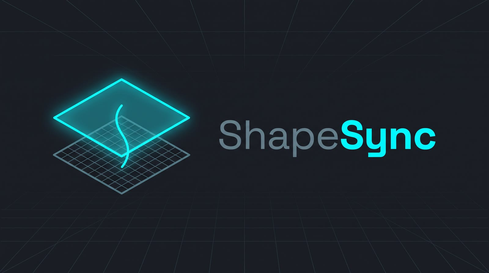
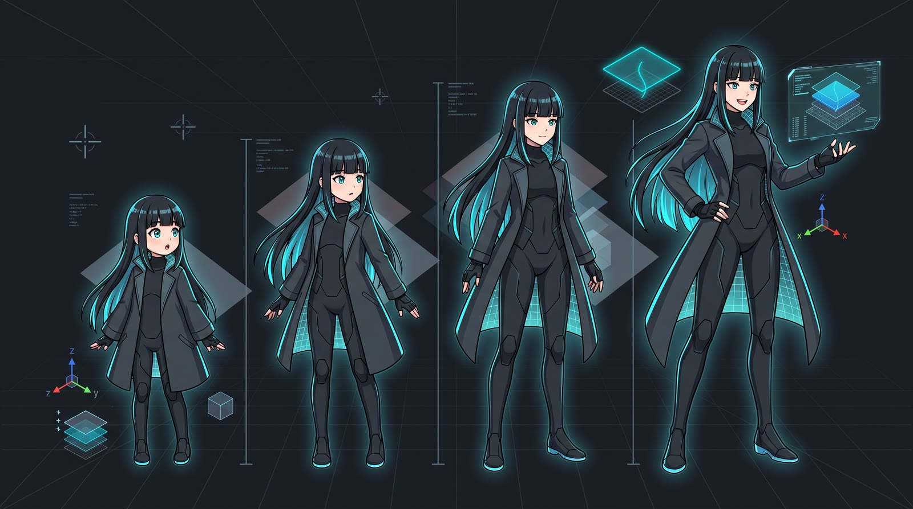

# ShapeSync

ShapeSync is a Unity toolset for building and attaching deformable character
Outfits that follow Figure body morphs.  The Core works without UniVRM; the
VRM Integration companion is an optional layer for VRM 1.0 initialization,
expression baking, and SpringBone transport.


*Official ShapeSync toolset logo.*


*Concept illustration of outfit deformation following body morphs; this is not
a runtime screenshot.*

## Requirements

- Unity 6.0 LTS or later (validation baseline: Unity 6000.3.18f1)
- Universal Render Pipeline (URP) 17.0.0 or later. The validation baseline is
  `com.unity.render-pipelines.universal` 17.3.0; ShapeSync Phase0 supports URP
  only, and the URP package supplies the required Lit/Unlit shader identities.
- A graphics API with async compute queue and fence support, such as D3D12 or
  Vulkan. On Windows, Unity 6.0 LTS (`6000.0`) defaults to D3D11 and requires
  a change; Unity 6.3 LTS (`6000.3`) defaults to D3D12 and needs confirmation.
  D3D11 is not a supported or guaranteed configuration for Texture StackMachine
  processing.
- Git 2.14 or later, with HTTPS access to the package repository
- NuGetForUnity 4.5.0 for the R3 .NET core dependency
- UniVRM 0.131.1 only when using the optional VRM Integration companion

ShapeSync Core does not require UniVRM or the Unity Input System.
The Core package includes the default Texture StackMachine Factory Settings
asset. Consumer projects must use Linear color space and set Asset
Serialization Mode to Mixed for the Core Slim Tests, Database assets, and the
automatic Texture StackMachine Factory path.

## Install

The package repository is consumed through Unity Package Manager. The
installation order is significant because the VRM companion depends on the
ShapeSync Core package, while R3's .NET core assemblies are supplied by
NuGetForUnity rather than by a ShapeSync package.

### Choose the project template

The recommended starting point is Unity Hub's **Universal 3D** template. On
Unity `6000.3.18f1` is the validation baseline for the Universal 3D route,
with URP 17.x and Linear color space. Confirm the URP Render Pipeline Asset
under **Project Settings > Graphics** / **Quality** rather than assuming a
particular serialized assignment. With that template, step 4 and the
color-space part of step 6 below are usually **confirmations**, not additional
setup actions. This API confirmation applies to the 6.3 validation baseline;
Unity 6.0 LTS defaults to D3D11 and requires the API change described in step
4. The Asset Serialization Mode part of step 6 still requires a change in both
template routes: new projects default to Force Text, but ShapeSync requires
Mixed. The template does not know about ShapeSync; the Core package supplies
its default Factory Settings asset.

If the project was created from Built-in RP or another non-URP template,
follow the explicit URP installation in step 4 and set Linear color space in
step 6. The Asset Serialization Mode requirement in step 6 is the same for
this route. Built-in RP, HDRP, and custom SRP are outside ShapeSync Phase0
support.

### 1. Add the OpenUPM scoped registry

In **Edit > Project Settings > Package Manager > Scoped Registries**, add:

```text
Name: OpenUPM
URL: https://package.openupm.com
Scopes: com.cysharp, com.vrmc, com.github-glitchenzo
```

`com.cysharp` and `com.vrmc` are required for ShapeSync dependencies.
`com.github-glitchenzo` is required only to install NuGetForUnity from the
same registry.

### 2. Install NuGetForUnity and the NuGet R3 package

In Package Manager, add the package by name:

```text
com.github-glitchenzo.nugetforunity 4.5.0
```

Open the Unity menu **NuGet > Manage NuGet Packages**, search for the NuGet
package `R3`, and install version `1.3.1` there. This is a different package
from the `R3 1.3.1` entry shown by Unity Package Manager in step 3: the latter
is the `com.cysharp.r3` Unity adapter. Do not treat that Package Manager entry
as proof that the NuGet package was installed.

Complete this step through the NuGetForUnity UI. It creates or updates the
consumer-side `Assets/packages.config` and `NuGet.config` and restores the
required .NET closure. Do not copy R3 DLLs into this repository or into either
ShapeSync package manually. Verify the actual payload, rather than a fixed
dependency count: `Assets/packages.config` contains `R3` version `1.3.1` with
`manuallyInstalled="true"`, and
`Assets/Packages/R3.1.3.1/lib/.../R3.dll` exists. The transitive package count
is environment-dependent.

Complete step 2 and let the NuGet restore finish before adding step 3. If the
R3 Unity adapter is added while the NuGet R3 assembly is still missing, Unity
compile errors stop domain reload, so NuGetForUnity's `[InitializeOnLoad]`
restore hook cannot run to repair the project automatically.

### 3. Install the R3 Unity adapter

In Package Manager, add by name:

```text
com.cysharp.r3 1.3.1
```

### 4. Confirm or install URP

For a Universal 3D project, confirm that the manifest contains URP `17.0.1`
or a later `17.x` version and that a URP Render Pipeline Asset is assigned in
**Project Settings > Graphics** / **Quality**. No installation action is
needed when those template defaults are present.

For a Built-in RP or other non-URP project, install and resolve:

```text
com.unity.render-pipelines.universal 17.0.0 or later
```

The validation baseline is `17.3.0` on Unity `6000.3.18f1`. The lower bound is
the Unity 6 URP 17.x line required by the Phase0 shader identities; `17.3.0`
is the tested version, not a request to change the fixed ShapeSync package tag.
For an application scene, assign a URP Render Pipeline Asset in the usual
**Project Settings > Graphics** / **Quality** locations. Built-in RP, HDRP,
and custom SRP are outside ShapeSync Phase0 support.

For Windows, open **Edit > Project Settings > Player > Other Settings >
Rendering > Graphics APIs for Windows**. Unity 6.0 LTS (`6000.0`) defaults to
D3D11, so this is a required change; Unity 6.3 LTS (`6000.3`) defaults to
D3D12, so this is a confirmation only. Turn off **Auto Graphics API** and put
**Direct3D12** first (or select Vulkan when that is the chosen supported API).
Restart the Editor after changing the Graphics API. The Texture StackMachine
uses an async compute queue and `GraphicsFence`; D3D11 is not supported or
guaranteed.

### 5. Install ShapeSync Core from Git

In Package Manager, choose **Add package from git URL** and enter:

```text
https://github.com/zgock999/ShapeSync.git?path=Packages/net.zgock-lab.shapesync#0.2.0
```

The `?path=` subfolder must appear before `#0.2.0`. The revision is
the lockstep package tag and must not be replaced with an unverified short
SHA.

### 6. Confirm or set consumer project settings

Set **Project Settings > Editor > Asset Serialization > Mode** to **Mixed**.
New Unity projects default to **Force Text**, so change it before importing or
using ShapeSync Database assets. The Database is large; Force Text expands it
to YAML and is impractical. Mixed preserves existing asset formats, but a
text asset becomes binary when Unity rewrites it. This side effect is accepted
so existing consumer text assets are not converted globally; do not replace
Mixed with Force Binary.

For a Universal 3D project, confirm **Project Settings > Player > Other
Settings > Rendering > Color Space** is **Linear**. The measured template
default is `m_ActiveColorSpace: 1`; no change is needed when it is present.
For a Built-in RP or other project, set the same property to **Linear**.
ShapeSync's material and texture contracts use Linear RGBA.

### 7. Install UniVRM only for VRM workflows

For VRM use, add these packages in order:

```text
com.vrmc.gltf 0.131.1
com.vrmc.vrm 0.131.1
```

Core-only projects skip this step.

### 8. Enable the optional VRM companion

After Core is installed, add the companion from git:

```text
https://github.com/zgock999/ShapeSync.git?path=Packages/net.zgock-lab.shapesync.vrm#0.2.0
```

Then add `SHAPESYNC_USE_UNIVRM` under **Project Settings > Player > Scripting
Define Symbols**. Keep the symbol absent for Core-only projects.

For Core-only projects, steps 1, 2, 3, 5, and 6 are required in both routes.
In the Universal 3D route, step 4 and the Linear color-space part of step 6
are confirmations of template-provided settings; the Asset Serialization Mode
part of step 6 still changes Force Text to Mixed. In the Built-in RP route,
step 4 installs URP and the Linear part of step 6 sets Linear; the Mixed
requirement is the same. Step 7 and step 8 are only for VRM workflows.

## Troubleshooting

### R3 types are missing

If Unity reports errors such as:

```text
The type or namespace name 'Collections' does not exist in the namespace 'R3'
The type or namespace name 'FrameProvider' could not be found
```

or `Observable<>` / `Unit` errors inside `com.cysharp.r3`, the NuGet R3 package
was not installed. If `Assets/packages.config` is empty or does not contain
`R3` with `manuallyInstalled="true"`, step 2 was not completed; the similarly
named `R3 1.3.1` in Unity Package Manager is only the step 3 adapter. Open
**NuGet > Manage NuGet Packages**, install NuGet `R3 1.3.1`, verify
`Assets/Packages/R3.1.3.1/lib/.../R3.dll`, and let Unity recompile.

### Texture processing fails on Windows

If the log contains an exception such as:

```text
NotSupportedException: Cannot determine if this AsyncQueueSynchronisation Graphics...
```

check **Player Settings > Other Settings > Rendering > Graphics APIs for
Windows**. Unity 6.0 LTS defaults to D3D11, so return to the Graphics API
configuration in step 4, turn off **Auto Graphics API**, put Direct3D12 first
or select Vulkan, and restart the Editor. D3D11 does not provide the async
compute queue/fence capability used by Texture StackMachine. Use D3D12 or
Vulkan; D3D11 is not supported or guaranteed.

### The VRM companion cannot find Core

The companion was added before the Core git package. Remove the companion,
add the Core URL first, wait for package resolution, then add the companion
and enable `SHAPESYNC_USE_UNIVRM`.

### Git reports a pathspec error

An incorrect `?path=` value produces an error similar to:

```text
Cannot checkout repository ... pathspec ... did not match any file(s) known to git
```

Use the exact URL above, including `.git`, the package subfolder, and the
`#0.2.0` revision.

### Console messages that are not install failures

A clean install writes three kinds of message to the Console. None of them
indicates a failed installation, and a manual walkthrough on Unity
`6000.3.18f1` reached a full Test Runner pass with all three present.

- `[Worker4] Could not generate preview image` errors. Unity emits these while
  generating asset previews during import; they do not affect the imported
  assets.
- Warnings that `com.github-glitchenzo.nugetforunity` and `com.cysharp.r3`
  were installed without a signature. Packages from registries other than
  Unity's own are unsigned, so this is expected for the OpenUPM route.
- A warning that Unity failed to import `Assets/NuGet.config` as a plug-in.
  NuGetForUnity writes that file as configuration, not as a managed plug-in,
  and the NuGet restore still completes.

Compilation errors, package resolution errors, and Test Runner failures are
not covered by this note and must be investigated.

## Documentation

- [Installation and dependencies](Docs/Installation.md)
- [Release packaging process](Docs/Packaging.md)
- [ShapeSync Documentation](https://zgock999.github.io/ShapeSync/)
- [Building the API reference](Docs/ApiReferenceBuild.md)

## Testing

The package repository contains Slim Tests only. Before testing, confirm that
URP is installed, Asset Serialization Mode is **Mixed**, the project Color
Space is **Linear**, and the Core package is resolved with
`SHAPESYNC_USE_UNIVRM` absent. The default Factory Settings asset is shipped
inside the Core package. For package test discovery, add the
Core package ID to the consumer project's
`testables` list in `Packages/manifest.json`:

```json
"testables": ["net.zgock-lab.shapesync"]
```

This enables the package's test assemblies for the Test Runner and is not a
runtime dependency. Then open **Window > General > Test Runner** and run the
package EditMode and PlayMode assemblies. A clean Core-only run is expected to
be 1,226 EditMode tests and 138 PlayMode tests in the 24.3 validation
baseline. The D3D12 Slim Test matrix recorded one documented batchmode
failure, `MeshOutfitMaterials_ClassificationControlUsesThreeExclusiveRadioOptions`,
in EditMode; no inconclusive result occurred. Any other failure or any
inconclusive result is a test failure and must be reported.

The internal Sandbox, Rich Tests, Human Test evidence, and PlayTest assets are
not part of the package distribution.

## License

ShapeSync is released under the [MIT License](LICENSE). R3 and UniVRM are
external dependencies; install them according to the steps above and follow
their own license terms. ShapeSync does not redistribute their source or
binaries.

Portions of the branding assets (Logo and Mascot design concepts/prompts) were
created with the assistance of Google AI (Gemini). Governed by the Google
Generative AI Additional Terms of Service (last modified February 14, 2024)
and Google Terms of Service (effective May 22, 2024). Google does not claim
ownership of the generated output. This disclosure applies only to the
branding assets and their design concepts/prompts, not to ShapeSync code,
tutorial artwork, or `CC0Animation.unitypackage`.
